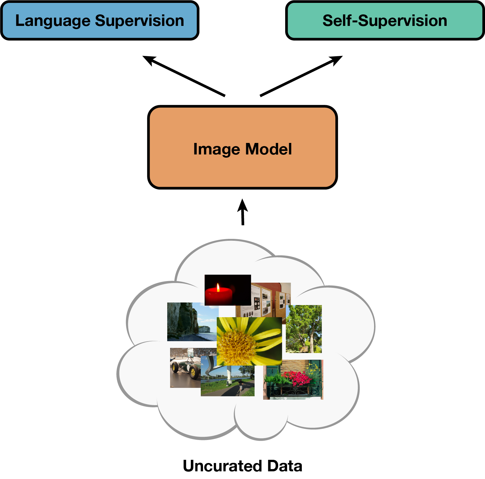

# [SLIP: Self-supervision meets Language-Image Pre-training](https://arxiv.org/abs/2112.12750)

<p align="center"></p>


## What you can find in this repo:
- Pre-trained models (with ViT-Small, Base, Large) and code to reproduce results from our paper: **[SLIP: Self-supervision meets Language-Image Pre-training](https://arxiv.org/abs/2112.12750).** *[Norman Mu](https://normanmu.com), [Alexander Kirillov](https://alexander-kirillov.github.io/), [David Wagner](http://people.eecs.berkeley.edu/~daw/) and [Saining Xie](https://sainingxie.com)*, arXiv 2021

- An improved CLIP baseline (31.3% → 34.6% ImageNet 0-shot w/ Modified ResNet-50) on YFCC15M dataset.
- Zero-shot transfer and linear classification evaluation scripts on **26** downstream datasets.

## Updates:

Jan 18 2022: Added support for training on RedCaps

Jan 17 2022: Released CC3M/CC12M CLIP/SLIP ViT-B checkpoints

## Results and Pre-trained Models
The following models are pre-trained on YFCC15M and evaluated on ImageNet-1K (ILSVRC2012).

### ViT-Small (MoCo v3 version w/ 12 vs. 6 heads)
<table><tbody>
<!-- START TABLE -->
<!-- TABLE HEADER -->
<th valign="center">Method</th>
<th valign="center">Epochs</th>
<th valign="center">0-shot</th>
<th valign="center">Linear</th>
<th valign="center">Finetuned</th>
<th valign="center">Weights</th>

<!-- TABLE BODY -->
<tr>
<td align="center">CLIP</td>
<td align="center">25</td>
<td align="center">32.7</td>
<td align="center">59.3</td>
<td align="center">78.2</td>
<td align="center"><a href="https://dl.fbaipublicfiles.com/slip/clip_small_25ep.pt">url</a></td>
</tr>
<tr>
<td align="center">SimCLR</td>
<td align="center">25</td>
<td align="center">-</td>
<td align="center">58.1</td>
<td align="center">79.9</td>
<td align="center"><a href="https://dl.fbaipublicfiles.com/slip/simclr_small_25ep.pt">url</a></td>
</tr>
<tr>
<td align="center">SLIP</td>
<td align="center">25</td>
<td align="center">38.3</td>
<td align="center">66.4</td>
<td align="center">80.3</td>
<td align="center"><a href="https://dl.fbaipublicfiles.com/slip/slip_small_25ep.pt">url</a></td>
</tr>
<tr>
<td align="center">SLIP</td>
<td align="center">50</td>
<td align="center">39.3</td>
<td align="center">67.6</td>
<td align="center">80.7</td>
<td align="center"><a href="https://dl.fbaipublicfiles.com/slip/slip_small_50ep.pt">url</a></td>
</tr>
<tr>
<td align="center">SLIP</td>
<td align="center">100</td>
<td align="center">39.5</td>
<td align="center">68.3</td>
<td align="center">80.7</td>
<td align="center"><a href="https://dl.fbaipublicfiles.com/slip/slip_small_100ep.pt">url</a></td>
</tr>
</tbody></table>

### ViT-Base
<table><tbody>
<!-- START TABLE -->
<!-- TABLE HEADER -->
<th valign="center">Method</th>
<th valign="center">Epochs</th>
<th valign="center">0-shot</th>
<th valign="center">Linear</th>
<th valign="center">Finetuned</th>
<th valign="center">Weights</th>

<!-- TABLE BODY -->
<tr>
<td align="center">CLIP</td>
<td align="center">25</td>
<td align="center">37.6</td>
<td align="center">66.5</td>
<td align="center">80.5</td>
<td align="center"><a href="https://dl.fbaipublicfiles.com/slip/clip_base_25ep.pt">url</a></td>
</tr>
<tr>
<td align="center">SimCLR</td>
<td align="center">25</td>
<td align="center">-</td>
<td align="center">64.0</td>
<td align="center">82.5</td>
<td align="center"><a href="https://dl.fbaipublicfiles.com/slip/simclr_base_25ep.pt">url</a></td>
</tr>
<tr>
<td align="center">SLIP</td>
<td align="center">25</td>
<td align="center">42.8</td>
<td align="center">72.1</td>
<td align="center">82.6</td>
<td align="center"><a href="https://dl.fbaipublicfiles.com/slip/slip_base_25ep.pt">url</a></td>
</tr>
<tr>
<td align="center">SLIP</td>
<td align="center">50</td>
<td align="center">44.1</td>
<td align="center">73.0</td>
<td align="center">82.9</td>
<td align="center"><a href="https://dl.fbaipublicfiles.com/slip/slip_base_50ep.pt">url</a></td>
</tr>
<tr>
<td align="center">SLIP</td>
<td align="center">100</td>
<td align="center">45.0</td>
<td align="center">73.6</td>
<td align="center">83.4</td>
<td align="center"><a href="https://dl.fbaipublicfiles.com/slip/slip_base_100ep.pt">url</a></td>
</tr>
</tbody></table>

### ViT-Large
<table><tbody>
<!-- START TABLE -->
<!-- TABLE HEADER -->
<th valign="center">Method</th>
<th valign="center">Epochs</th>
<th valign="center">0-shot</th>
<th valign="center">Linear</th>
<th valign="center">Finetuned</th>
<th valign="center">Weights</th>

<!-- TABLE BODY -->
<tr>
<td align="center">CLIP</td>
<td align="center">25</td>
<td align="center">40.4</td>
<td align="center">70.5</td>
<td align="center">81.0</td>
<td align="center"><a href="https://dl.fbaipublicfiles.com/slip/clip_large_25ep.pt">url</a></td>
</tr>
<tr>
<td align="center">SimCLR</td>
<td align="center">25</td>
<td align="center">-</td>
<td align="center">66.7</td>
<td align="center">84.0</td>
<td align="center"><a href="https://dl.fbaipublicfiles.com/slip/simclr_large_25ep.pt">url</a></td>
</tr>
<tr>
<td align="center">SLIP</td>
<td align="center">25</td>
<td align="center">46.2</td>
<td align="center">76.0</td>
<td align="center">84.2</td>
<td align="center"><a href="https://dl.fbaipublicfiles.com/slip/slip_large_25ep.pt">url</a></td>
</tr>
<tr>
<td align="center">SLIP</td>
<td align="center">50</td>
<td align="center">47.4</td>
<td align="center">75.8</td>
<td align="center">84.7</td>
<td align="center"><a href="https://dl.fbaipublicfiles.com/slip/slip_large_50ep.pt">url</a></td>
</tr>
<tr>
<td align="center">SLIP</td>
<td align="center">100</td>
<td align="center">47.9</td>
<td align="center">75.1</td>
<td align="center">84.8</td>
<td align="center"><a href="https://dl.fbaipublicfiles.com/slip/slip_large_100ep.pt">url</a></td>
</tr>
</tbody></table>

### Additional Datasets and Models
<table><tbody>
<!-- START TABLE -->
<!-- TABLE HEADER -->
<th valign="center">Dataset</th>
<th valign="center">Method</th>
<th valign="center">Model</th>
<th valign="center">Epochs</th>
<th valign="center">0-shot</th>
<th valign="center">Linear</th>
<th valign="center">Finetuned</th>
<th valign="center">Weights</th>

<!-- TABLE BODY -->
<tr>
<td align="center">CC3M</td>
<td align="center">CLIP</td>
<td align="center">ViT-B</td>
<td align="center">40</td>
<td align="center">17.1</td>
<td align="center">53.3</td>
<td align="center">79.5</td>
<td align="center"><a href="https://dl.fbaipublicfiles.com/slip/clip_base_cc3m_40ep.pt">url</a></td>
</tr>
<tr>
<td align="center">CC3M</td>
<td align="center">SLIP</td>
<td align="center">ViT-B</td>
<td align="center">40</td>
<td align="center">23.0</td>
<td align="center">65.4</td>
<td align="center">81.4</td>
<td align="center"><a href="https://dl.fbaipublicfiles.com/slip/slip_base_cc3m_40ep.pt">url</a></td>
</tr>
<tr>
<td align="center">CC12M</td>
<td align="center">CLIP</td>
<td align="center">ViT-B</td>
<td align="center">35</td>
<td align="center">36.5</td>
<td align="center">69.0</td>
<td align="center">82.1</td>
<td align="center"><a href="https://dl.fbaipublicfiles.com/slip/clip_base_cc12m_35ep.pt">url</a></td>
</tr>
<tr>
<td align="center">CC12M</td>
<td align="center">SLIP</td>
<td align="center">ViT-B</td>
<td align="center">35</td>
<td align="center">40.7</td>
<td align="center">73.7</td>
<td align="center">83.1</td>
<td align="center"><a href="https://dl.fbaipublicfiles.com/slip/slip_base_cc12m_35ep.pt">url</a></td>
</tr>

</tbody></table>

## 1. Setup
Install [PyTorch](https://pytorch.org) and [timm](https://github.com/rwightman/pytorch-image-models). 
The code has been tested with CUDA 11.3/CuDNN 8.2.0, PyTorch 1.10.0 and timm 0.5.0.

### 1.1. YFCC15M Setup
Download the [YFCC100M dataset](https://multimediacommons.wordpress.com/yfcc100m-core-dataset/).
Our dataloader expects the following dataset directory structure with 100 folders containing 1000 zip archives of 1000 images each.
The concatenation of the folder, archive, and file names is the index of the image (i.e. image 12345678 is stored as `678.jpg` within `12/345.zip`):

```
/path/to/yfcc100m/
├── images/
│   ├── 00/
│   │   └── 000.zip
│   │   │   ├── 000.jpg
│   │   │   │   ...
│   │   │   └── 999.jpg
│   │   ...
│   │   └── 999.zip
│   ...
│   └── 99/
...
```

Prepare the YFCC15M subset metadata pickle:
1. Download and compile a list of downloaded images to `flickr_unique_ids.npy` ([ours](https://dl.fbaipublicfiles.com/deepcluster/flickr_unique_ids.npy))
2. Download OpenAI's list of captioned YFCC100M images according to instructions [here](https://github.com/openai/CLIP/blob/8cad3a736a833bc4c9b4dd34ef12b52ec0e68856/data/yfcc100m.md)
3. Run `python make_dataset.py` to create the `yfcc15m.pkl` metadata pickle

When pre-training with YFCC15M, set `--dataset yfcc15m --root /path/to/yfcc100m --metadata /path/to/yfcc15m.pkl`.

### 1.2. COCO Captions Setup
Download and unzip the 2017 Train [images](http://images.cocodataset.org/zips/train2017.zip) and [annotations](http://images.cocodataset.org/annotations/annotations_trainval2017.zip).
When pre-training on COCO, set `--dataset coco --root /path/to/coco --metadata /path/to/captions_train2017.json`.

### 1.3. Conceptual Captions Setup
[CC3M](https://ai.google.com/research/ConceptualCaptions/download) and [CC12M](https://github.com/google-research-datasets/conceptual-12m) are published as tsv files listing original image urls and processed captions.
Download images and collect the captions of all available images (many will be missing due to broken links) into `cc3m.npy` and `cc12m.npy`.

For CC3M our dataloader expects `cc3m.npy` to contain a NumPy array of dicts in the following format:

```
{
  'image_id': 1510438788,  # local file path relative to root
  'captions': ['large field with pink tulips on a clear sunny summer day with a blue sky']
}
```

For CC12M our dataloader expects `cc12m.npy` to contain a NumPy array of dicts in the following format:

```
{
  'image_name': '0.jpg',  # local file path relative to root
  'image_id': 0,
  'captions': ['Metal Design Within Reach Ivory Slipper Chairs - a Pair For Sale - Image 7 of 10']
}
```

When pre-training on CC3M set `--dataset cc3m --root /path/to/cc3m --metadata /path/to/cc3m.npy`, and whe pre-training on CC12M set `--dataset cc12m --root /path/to/cc12m --metadata /path/to/cc12m.npy`.

### 1.4. RedCaps Setup
[RedCaps](https://redcaps.xyz) is published as a list of JSON annotation files containing image urls and raw/processed captions.
Images can be downloaded from these annotations with a helpful [downloader tool](https://github.com/redcaps-dataset/redcaps-downloader).
Then merge all per-subreddit annotations into a single file with the [combine_captions.py](redcaps/combine_captions.py) script:

```
python redcaps/combine_captions.py --input /path/to/redcaps/annotations --output /path/to/redcaps_v1.json
```

To pre-train on RedCaps set `--dataset redcaps --root /path/to/redcaps --metadata /path/to/redcaps_v1.json`.


### 1.4. Downstream Dataset Setup
Zero-shot (in [main.py](main.py) and [eval_zeroshot.py](eval_zeroshot.py)) and linear (in [main_linear.py](main_linear.py)) evaluations read dataset paths from [dataset_catalog.json](dataset_catalog.json).
Zero-shot evaluations read CLIP's class labels and caption templates from [labels.json](labels.json) and [templates.json](templates.json).
If just pre-training models on YFCC15M, only the ImageNet path is required for model validation between training epochs.
See Section 3 below on zero-shot transfer evaluation for dataset preparation details.

## 2. Pre-training
We use the following pre-training recipes for SLIP, CLIP, and SimCLR.
See [main.py](main.py) for the full list of default arguments.
We use the same lr and wd settings for all model sizes within the same training framework, and different model sizes can be selected by passing in different strings to the `--model` argument such as `SLIP_VITS16` or `SLIP_VITL16`.

In our workflow we use [submitit](https://github.com/facebookincubator/submitit), which interfaces nicely with Slurm.
For local training with the [torchrun](https://pytorch.org/docs/stable/elastic/run.html) utility (supersedes `torch.distributed.launch`), replace `python run_with_submitit.py` with `torchrun --nproc_per_node=8 main.py`. 
Local multi-node training with `torchrun` should also be possible.

We train most of our models on 8x 8-gpu nodes, but training with fewer gpus is possible by reducing the batch size and setting the `--update-freq` argument above 1 to enable gradient accumulation.
Note that gradient accumulation will increase the variance of minibatch statistics and alter the training dynamics of batchnorm, which is used in SLIP and SimCLR.

### SLIP ViT-Base with 8-nodes (batch size 4096)
```
python run_with_submitit.py \
  --root /path/to/yfcc100m \
  --model SLIP_VITB16 \
  --lr 3e-3 --wd 0.1
```

### CLIP ViT-Base with 8-nodes (batch size 4096)
```
python run_with_submitit.py \
  --root /path/to/yfcc100m \
  --model CLIP_VITB16 \
  --lr 5e-4 --wd 0.5
```

### SimCLR ViT-Base with 8-nodes (batch size 4096)
```
python run_with_submitit.py \
  --root /path/to/yfcc100m \
  --model SIMCLR_VITB16 \
  --ssl-mlp-dim 4096 --ssl-emb-dim 256 --ssl-temp 0.1 \
  --lr 3.2e-3 --wd 0.1 
```

Some important arguments:

`--dataset`: pre-training dataset name. choices include `yfcc15m`, `cc12m`, `cc3m`, `coco`.

`--root`: path to dataset root

`--metadata`: path to metadata file (see section 1 for details)

`--ssl-mlp-dim`: hidden dim of SimCLR mlp projection head

`--ssl-emb-dim`: output embed dim of SimCLR mlp projection head

`--ssl-scale`: loss scale for SimCLR objective

`--ssl-temp`: softmax temperature for SimCLR objective

`--batch-size`: number of samples per-device/per-gpu 

`--lr-start`: initial warmup lr

`--lr-end`: minimum final lr

`--update-freq`: optimizer update frequency, i.e. gradient accumulation steps

`--disable-amp`: disable mixed-precision training (requires more memory and compute)

## 3. Evaluation: Zero-shot Transfer
First, prepare additional downstream classification datasets:
- MNIST, CIFAR-10/100, STL-10: Automatic download via [torchvision datasets](https://pytorch.org/vision/stable/datasets.html)
- HatefulMemes: Manual download from [official website](https://hatefulmemeschallenge.com/#download) and sort images according to `train.jsonl`/`dev.jsonl` into train/dev folder
- Rendered SST2, Country211: Manual download from [CLIP repo](https://github.com/openai/CLIP/tree/main/data)
- Other datasets: Use scripts from [VISSL](https://github.com/facebookresearch/vissl/tree/main/extra_scripts/datasets)

Then set all dataset paths in [dataset_catalog.json](dataset_catalog.json).

Evaluate zero-shot transfer to various classification benchmarks with [eval_zeroshot.py](eval_zeroshot.py), which reads labels and templates from [labels.json](labels.json)/[templates.json](templates.json) and dataset paths from [dataset_catalog.json](dataset_catalog.json). Inference is performed with a single gpu. By default, the script iterates through all datasets in [dataset_catalog.json](dataset_catalog.json) and evaluates zero-shot in order. Evaluation can be limited to a subset of datasets by replacing `for d in datasets:` with `for d in ['imagenet']:` on line 78.

```
python eval_zeroshot.py --resume /path/to/checkpoint.pt
```

## 4. Evaluation: Linear Classification
We use a modified version of the MoCo v3 ImageNet linear classification script, [main_linear.py](main_linear.py).
We use the same single node 8-gpu recipe for all model sizes.
See [main_linear.py](main_linear.py) for the full list of default arguments.
As with pre-training, our workflow uses [submitit](https://github.com/facebookincubator/submitit).
For local training with [torchrun](https://pytorch.org/docs/stable/elastic/run.html), replace `python run_with_submitit_linear.py` with `torchrun --nproc_per_node=8 main_linear.py`. 
This script reads the ImageNet dataset path from the dataset catalog ([dataset_catalog.json](dataset_catalog.json)), which must be set properly before training.

```
python run_with_submitit_linear.py  \
  --arch vit_base_patch16_224 --dataset imagenet \
  --pretrained /path/to/checkpoint.pt
```

To evaluate linear classification on other datasets, set `--dataset` to the corresponding dataset name listed in [dataset_catalog.json](dataset_catalog.json).

## 5. Evaluation: End-to-End Finetuning
We use a modified version of the ImageNet finetuning script from [BeiT](https://github.com/microsoft/unilm/tree/f8f3df80c65eb5e5fc6d6d3c9bd3137621795d1e/beit).
Our code has been tested with commit `f8f3df8`.
We have removed the explicit torch, torchvision, and timm dependencies from [beit_finetuning/requirements.txt](beit_finetuning/requirements.txt), as they conflict with the versions used in our SLIP code (CUDA 11.3/CuDNN 8.2.0, PyTorch 1.10.0 and timm 0.5.0).
The fintuning code has been modified and tested to work with these versions.

### 5.1. Setup
To evaluate end-to-end finetuning on ImageNet, first clone the BeiT repo and checkout the correct commit:

```
git clone git@github.com:microsoft/unilm.git
cd unilm/beit
git checkout f8f3df8
```

Now copy over modified files from our [beit_finetuning](beit_finetuning) directory:

```
cp beit_finetuning/* unilm/beit
cd unilm/beit
```

Install pip dependencies and Nvidia Apex:

```
pip install -r requirements.txt
git clone https://github.com/NVIDIA/apex
cd apex
pip install -v --disable-pip-version-check --no-cache-dir --global-option="--cpp_ext" --global-option="--cuda_ext" ./
```


### 5.2. Commands
As with pre-training, our workflow uses [submitit](https://github.com/facebookincubator/submitit).
For local training with [torchrun](https://pytorch.org/docs/stable/elastic/run.html), replace `python run_with_submitit_finetune.py` with `torchrun --nproc_per_node=8 run_class_finetuning.py`. 
We established finetuning recipes based on the BeiT recipes with some light additional hyperparameter tuning.
We increase regularization with model size: ViT-S uses drop_path=0 and layer_decay=0.65, ViT-B uses drop_path=0.1 and layer_decay=0.65, and ViT-L uses drop_path=0.1 and layer_decay=0.75.
Note the use of the `--finetune` argument instead of `--resume`.

### ViT-Small (MoCo v3 version w/ 12 vs. 6 heads)

```
python run_with_submitit_finetune.py \
    --batch_size 128 --enable_deepspeed \
    --epochs 100 --warmup_epochs 20 \
    --model beit_small_patch16_224 --nb_classes 1000 \
    --imagenet_default_mean_and_std \
    --model_key state_dict --model_prefix module.visual. \
    --disable_rel_pos_bias --abs_pos_emb --use_cls \
    --mixup 0.8 --cutmix 1 \
    --layer_scale_init_value 0 \
    --lr 4e-3 --drop_path 0 --layer_decay 0.65 \
    --output_dir /path/to/output_dir --finetune /path/to/checkpoint.pt
```

### ViT-Base

```
python run_with_submitit_finetune.py \
    --batch_size 128 --enable_deepspeed \
    --epochs 100 --warmup_epochs 20 \
    --model beit_base_patch16_224 --nb_classes 1000 \
    --imagenet_default_mean_and_std \
    --model_key state_dict --model_prefix module.visual. \
    --disable_rel_pos_bias --abs_pos_emb --use_cls \
    --mixup 0.8 --cutmix 1 \
    --layer_scale_init_value 0 \
    --lr 4e-3 --drop_path 0.1 --layer_decay 0.65 \
    --output_dir /path/to/output_dir --finetune /path/to/checkpoint.pt
```

### ViT-Large

```
python run_with_submitit_finetune.py \
    --batch_size 128 --enable_deepspeed \
    --epochs 50 --warmup_epochs 5 \
    --model beit_large_patch16_224 --nb_classes 1000 \
    --imagenet_default_mean_and_std \
    --model_key state_dict --model_prefix module.visual. \
    --disable_rel_pos_bias --abs_pos_emb --use_cls \
    --mixup 0.8 --cutmix 1 \
    --layer_scale_init_value 0 \
    --lr 4e-3 --drop_path 0.1 --layer_decay 0.75 \
    --output_dir /path/to/output_dir --finetune /path/to/checkpoint.pt
```


### License

This project is under the MIT license. See [LICENSE](LICENSE) for details.

### Citation
```
@Article{mu2021slip,
  author  = {Norman Mu and Alexander Kirillov and David Wagner and Saining Xie},
  title   = {SLIP: Self-supervision meets Language-Image Pre-training},
  journal = {arXiv preprint arXiv:2112.12750},
  year    = {2021},
}
```
